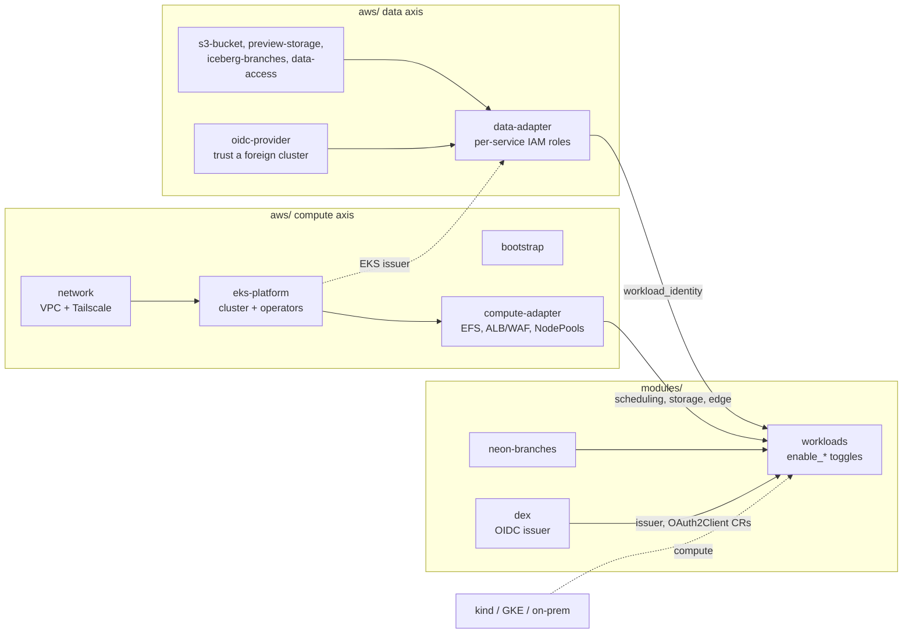

# lab-platform

A composable family of OpenTofu modules for running a data/ML platform on
Kubernetes — JupyterHub, Ray, Dagster, MLflow, and a public webapp, each behind
an `enable_*` toggle — with **first-class preview environments**: per PR, the
workloads stamped on the shared cluster, copy-on-write branches of prod's
databases, and isolated (empty) object and table stores -- or, opt-in, forks
inside prod's stores.

The application layer (`modules/workloads`) is cloud-agnostic: it needs only
the kubernetes/helm providers and runs on EKS, kind, or any other cluster.
Cloud specifics live in per-backend adapters, split along two axes because
**data is harder to move than compute**: `aws/data-adapter` gives pods on *any*
cluster identity to AWS data stores, `aws/compute-adapter` covers what is bound
to an EKS cluster itself. AWS is the only backend today; the seam is
documented so `gcp/`, `azure/` or `metal/` can follow. (The repo used to be
`terraform-aws-lab-platform`; with a portable core and a backend directory per
cloud the registry's `terraform-<provider>-` convention no longer describes
it, and modules are consumed by `github.com/...//path` source refs anyway.
GitHub redirects the old name.)

> Status: extracted from a production stack and genericized for open source.
> Wiring is validated (`tofu validate` + plan-only `tofu test`), and the
> workloads with OIDC auth and tenants run end to end on kind in CI. A
> reference deployment in its own AWS account runs the template app's preview
> loop end to end on EKS, in both data modes: Neon branches and empty stores
> per PR, and tether forks of the production stores, kept across pushes and
> discarded when the PR closes; it also exercises the nightly data pull, the
> sweep and pausing the cluster. A full apply needs your own AWS account, DNS,
> and (optionally) Tailscale/Neon.

## Modules

Portable (any Kubernetes cluster, any data backend):

| Module | What it is |
| ------ | ---------- |
| [`modules/workloads`](modules/workloads) | webapp / JupyterHub / Dagster / MLflow / Argo Workflows / Ray, `name_prefix`-stamped and toggleable; consumes the identity / scheduling / storage / public-ingress contract inputs |
| [`modules/neon-branches`](modules/neon-branches) | Copy-on-write Neon Postgres branches per preview |
| [`modules/dex`](modules/dex) | The cluster's OIDC issuer (Dex): brokers Google / GitHub / LDAP / SAML or a CI password DB; environments register their own OAuth2 clients as CRs. Pairs with `modules/workloads` `auth = { mode = "oidc" }` |
| [`modules/keycloak`](modules/keycloak) | The cluster's user store (Keycloak) behind Dex: users, tenants, delegated admins, brokered upstream logins |
| [`modules/keycloak-realm`](modules/keycloak-realm) | The platform realm: tenants as group subtrees, superadmins, tenant and group admins (fine-grained admin permissions v2), the Dex client with full-path groups |
| [`modules/tenancy`](modules/tenancy) | Which tenant runs where: validates the tenancy matrix against what each service can isolate and returns the shared instance's hooks and each tenant's stamp spec ([docs/tenancy.md](docs/tenancy.md)) |
| [`modules/postgres-group-roles`](modules/postgres-group-roles) | `nb_<tenant>__<group>` login roles for notebooks and tenant compute, scoped by the app's row-level security |

AWS backend, data axis (usable from any compute):

| Module | What it is |
| ------ | ---------- |
| [`aws/data-adapter`](aws/data-adapter) | Per-service IAM roles for S3 / S3 Tables / ECR trusting any OIDC issuer; emits `workload_identity` (IRSA on EKS, projected token elsewhere) |
| [`aws/oidc-provider`](aws/oidc-provider) | Registers a non-EKS cluster's issuer with IAM; can host the discovery doc + JWKS on S3 for kind/on-prem |
| [`aws/s3-bucket`](aws/s3-bucket) | Hardened, KMS-encrypted bucket + ready-made IAM policies |
| [`aws/preview-storage`](aws/preview-storage) | Ephemeral per-preview bucket |
| [`aws/iceberg-branches`](aws/iceberg-branches) | Ephemeral per-preview Iceberg (S3 Tables) namespace with namespace-scoped IAM |
| [`aws/data-access`](aws/data-access) | Read/write-no-delete IAM on prod store prefixes and Iceberg tables, for previews whose data is forked by a dataset tool (tether mode) |
| [`aws/tenant-data`](aws/tenant-data) | One tenant's IAM role (its ServiceAccounts only), its prefix of the shared bucket or a bucket of its own, and optionally its own database |

AWS backend, compute axis (an EKS cluster):

| Module | What it is |
| ------ | ---------- |
| [`aws/bootstrap`](aws/bootstrap) | State bucket + lock table + GitHub OIDC CI/preview roles (least-privilege) + optional MFA-gated operator role with guardrails |
| [`aws/network`](aws/network) | VPC (pod secondary CIDR, VPC endpoints) + optional Tailscale subnet router |
| [`aws/eks-platform`](aws/eks-platform) | EKS cluster + cluster-wide operators and CRDs (Karpenter, LB controller, external-dns, monitoring, GPU, KubeRay, Argo CRDs, Tailscale) |
| [`aws/compute-adapter`](aws/compute-adapter) | EFS for JupyterHub, ALB/ACM/WAF edge annotations, Karpenter NodePools; emits `jupyterhub_shared_storage`, public-ingress inputs and `scheduling` |

## Architecture



Pick a cell of the data x compute matrix and wire the adapters for it:

| | AWS data (S3, S3 Tables, Neon) | Local data (SeaweedFS, Postgres) |
| --- | --- | --- |
| **EKS compute** | `examples/complete`, `minimal`, `jupyterhub`, `preview` -- `data-adapter` (`binding = "webhook"`) + `compute-adapter` | (not a useful cell) |
| **kind / GKE / on-prem compute** | [`examples/kind-aws-data`](examples/kind-aws-data) -- `oidc-provider` + `data-adapter` (`binding = "projected"`); the pods reach prod-shaped data with per-service roles and no static keys | [`examples/kind`](examples/kind) -- static credentials, everything on a laptop or a free CI runner |

`bootstrap`, `network`, and `eks-platform` are applied once to stand up the
shared cluster. `workloads` with its two adapters (plus `preview-storage` +
`neon-branches` for previews) is applied once per environment against that
shared cluster, each with its own `name_prefix`. Data gravity still applies:
S3 egress and latency mean heavy jobs belong next to the data; local compute
is for development, cheap GPU bursts on subsets, and hardware AWS does not have.

## Quickstart

On a laptop, free: the workloads with Dex, Keycloak and two tenants on kind,
against local SeaweedFS and Postgres (Docker and ~6 GiB of memory).

```bash
cd examples/kind
scripts/up.sh       # cluster, prerequisites, tofu apply, health checks (~8 min)
tofu output port_forwards
scripts/down.sh
```

On AWS (about $225 a month, see [Cost](#cost)): a VPC, an EKS cluster and one
webapp.

```bash
cd examples/minimal
cp terraform.tfvars.example terraform.tfvars   # set webapp_image, region
tofu init

# First apply only: create the cluster before planning the workloads on it.
tofu apply -target=module.network -target=module.platform
tofu apply
```

See the runnable examples:

- [`examples/kind`](examples/kind) — everything on a laptop or a free CI runner.
- [`examples/minimal`](examples/minimal) — VPC + cluster + one webapp, cheapest AWS path.
- [`examples/complete`](examples/complete) — the full surface (monitoring, GPU,
  Ray, all workloads, Tailscale, public + private ingress).
- [`examples/jupyterhub`](examples/jupyterhub) — multi-user lab: per-user logins,
  per-user + shared EFS directories, marimo in the launcher.
- [`examples/preview`](examples/preview) — the flagship: workspace-per-PR preview
  environments on a shared cluster.
- [`examples/ephemeral-ray`](examples/ephemeral-ray) — Argo/Dagster spinning up
  throwaway Ray clusters per job ([design](docs/ephemeral-ray.md)).

## Preview environments (the flagship feature)

Each PR gets a full, isolated copy of the workloads on the **shared** cluster:
name-prefixed namespaces/IAM/NodePools, its own copy-on-write database branches,
and an ephemeral S3 bucket — then it all disappears on teardown, prod untouched.
The reusable [`preview-up`/`preview-down`/`nightly-sweep`](.github/workflows)
workflows and the least-privilege preview role in `aws/bootstrap` make it
runnable from CI.

The preview's *data* has two providers. Terraform (the modules above) stamps
isolated copies: branches of prod's Postgres, empty object and table stores.
[tether](https://github.com/elyall/tether) forks the production stores
themselves — a branch per preview in Neon, Icechunk, Iceberg and Lance off a
pinned baseline, discarded when the PR closes, merged or not — with
[`aws/data-access`](aws/data-access) as its IAM, which means the preview's
pods can write into prod's buckets and commit to prod's tables (never
delete): opt in only where the PR's code is trusted with that. Both hand pods
the same `DATABASE_URL` + `DATA_REFS` contract; the template app shows them
side by side behind a `fork_provider` toggle. What a preview can reach, and
what it cannot, is in the design doc's "Trust" section.

Read the design writeup: [`docs/preview-environments.md`](docs/preview-environments.md).

## Design choices worth calling out

- **Provider blocks are hoisted** out of every module, so modules compose with
  `count`/`for_each` and a caller configures each provider once.
- **Lean defaults**: monitoring/Kubecost/FluentBit are off; a single NAT gateway;
  a public cluster endpoint only where an example needs reachability. Turn the
  expensive knobs on per environment.
- **Bring-your-own private ingress**: Tailscale is the documented happy path, but
  `private_ingress_class_name` lets you point at any private ingress controller.
  With Tailscale, `private_ingress_annotations` puts per-service device tags on
  the proxies (`tailscale.com/tags`), so your tailnet ACL can grant UIs
  individually — ops UIs to a platform group, the webapp to every member, and a
  whole preview environment under one tag. Reachability is the access control
  for UIs that ship no auth of their own, and since the tailnet's login provider
  is your IdP (e.g. Google), those grants are grants on real user identities.
- **Explicit couplings**: Dagster→Ray is a precondition with a clear error, not a
  silent `&&`.
- **Secrets stay module inputs** (sensitive vars); the SSM Parameter Store
  pattern is shown in examples, never baked into modules.

## Persistent data & deletion guards

Almost everything in this family is intentionally disposable (that's what makes
previews cheap). The few places real data persists are each guarded against an
accidental `destroy`:

| Data | Where | Guard |
| --- | --- | --- |
| Terraform state | `aws/bootstrap` S3 bucket | Versioning + a Deny `s3:DeleteBucket` bucket policy (`state_bucket_prevent_destroy`, default on); with the operator role on, an identity Deny on `DeleteObjectVersion` and on removing the bucket policy from a non-MFA key |
| State locks | `aws/bootstrap` DynamoDB table | Native deletion protection (`lock_table_deletion_protection`, default on); with the operator role on, an identity Deny on `DeleteTable` and on flipping the flag from a non-MFA key |
| JupyterHub user homes + shared dir | `aws/compute-adapter` EFS filesystem (`modules/workloads` only binds to it, so destroying the workloads never deletes homes) | `lifecycle.prevent_destroy` (`jupyterhub_efs_prevent_destroy`, default on); back up via the `jupyterhub_efs_id` output |
| Durable object data | `aws/s3-bucket` | Deny `s3:DeleteBucket` policy + a KMS key policy denying `kms:ScheduleKeyDeletion` (`prevent_destroy`), `force_destroy = false`, versioning |
| Databases | External (Neon/RDS — never module-managed) | Provider-side (e.g. Neon retains parents; previews only ever touch child branches) |

Everything else — preview buckets, Neon branches, namespaces, Helm releases,
NodePools, ephemeral Ray clusters — is meant to be destroyed freely. The
guarded resources make teardown a deliberate two-step: disarm the guard in one
apply, destroy in the next. Prometheus/MLflow/hub-db PVCs ride on EBS with the
cluster's default reclaim policy and are treated as rebuildable caches; if you
care about them, switch their StorageClass to `reclaimPolicy: Retain`.

The guards above stop a stray `destroy`. They do not stop a person — or a leaked
long-lived access key — from turning the guards off first. For that, the
operator's static identity keeps only the right to step up into an MFA-gated
role, and a Deny policy protects the guards and the role from anything that is
not that role. How to set that up, and how to actually run tofu through it, is
in [`docs/operator-access.md`](docs/operator-access.md).

## Who may open what

By default the private network is the login: behind the Tailscale operator
every UI request already names the caller, and the tailnet ACL grants UIs by
tag. `modules/workloads` `auth = { mode = "oidc" }` makes that independent of
the network: one [Dex](modules/dex) issuer per cluster brokering whatever IdP
you run (Google, GitHub, LDAP, SAML -- swap it in one place), an
`oauth2-proxy` in front of each UI that cannot log users in itself with
per-service group gates, Argo and JupyterHub on native OIDC, and the webapp
running its own login so that users, sessions and group memberships live in
*its* database and branch with every preview. Design and the state map in
[`docs/auth.md`](docs/auth.md); `examples/kind` runs it end to end.

## Keeping it current

Dependabot handles providers, modules and Actions. The Helm chart pins in the
module defaults are checked monthly by the `chart-drift` workflow (strictest for
the Tailscale operator chart, which is the Tailscale version of every proxy on
the tailnet), and the three update paths for Tailscale clients — containers,
the relay, everything else — are in [`docs/upgrades.md`](docs/upgrades.md).

## Cost

The baseline shared platform (`examples/minimal`) is roughly:

| Item | ~$/mo (us-west-2, on-demand) |
| ---- | ---------------------------- |
| EKS control plane | 73 |
| Core node group (2× t3a.large) | 120 |
| Single NAT gateway | 33 |
| **Baseline** | **~225** |

`examples/complete` adds monitoring, per-AZ NAT, a persistent Ray cluster, and
GPU NodePools — expect hundreds to low thousands per month. Previews add only the
pods/nodes they actually schedule on top of the shared cluster.

## Requirements

- OpenTofu >= 1.12. The family is OpenTofu-only: the persistent-data guards use
  dynamic `prevent_destroy` (1.12+), which Terraform's literal-only rule
  rejects — Terraform users would need to reintroduce the two-resource guard
  variants this feature made unnecessary.
- AWS provider >= 6.40 across the family (the EKS module is pinned to v21, which
  requires the aws v6 provider).

## Security

Report vulnerabilities privately ([SECURITY.md](SECURITY.md)). Two defaults
are weaker than they look, and matter to anyone running the preview
workflows: a preview deploys as cluster-admin, so whoever can push a branch to
the app repository can change the whole cluster, prod's namespaces included;
and the preview permissions boundary caps actions, not resources, until you
set `aws/bootstrap`'s `preview_boundary_resources`. SECURITY.md and the
design doc's "Trust" section say what each allows and what to do.

## Development

[CONTRIBUTING.md](CONTRIBUTING.md) has the six CI gates (fmt, validate,
tflint, checkov, terraform-docs, tofu test) and how to run them locally.

## License

[Apache-2.0](LICENSE); see [NOTICE](NOTICE) for the copyright holder and the
adapted Helm values.
