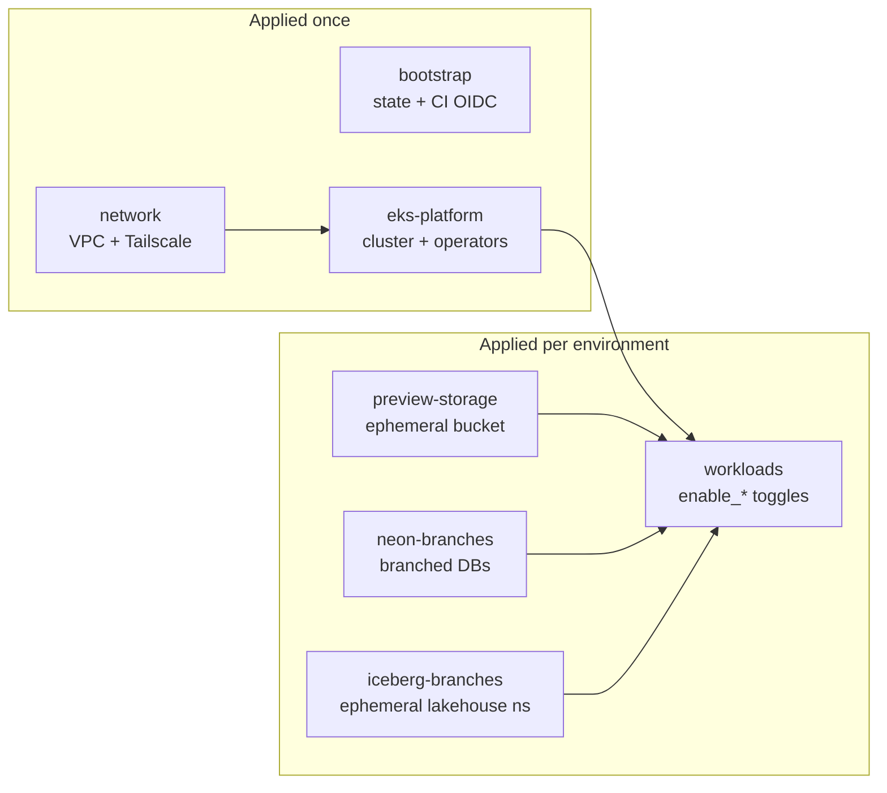

# terraform-aws-lab-platform

A composable family of OpenTofu modules for running a data/ML platform on AWS
EKS — JupyterHub, Ray, Dagster, MLflow, and a public webapp, each behind an
`enable_*` toggle — with **first-class preview environments** that branch prod
for testing, off prod. (The repo keeps the `terraform-aws-*` name because both
registries require that naming convention.)

> Status: extracted from a production stack and genericized for open source.
> Wiring is validated (`tofu validate` + plan-only `tofu test`); a full apply
> needs your own AWS account, DNS, and (optionally) Tailscale/Neon.

## Modules

| Module | What it is |
| ------ | ---------- |
| [`modules/bootstrap`](modules/bootstrap) | State bucket + lock table + GitHub OIDC CI/preview roles (least-privilege) |
| [`modules/network`](modules/network) | VPC (pod secondary CIDR, VPC endpoints) + optional Tailscale subnet router |
| [`modules/eks-platform`](modules/eks-platform) | EKS cluster + cluster-wide operators (Karpenter, LB controller, monitoring, GPU, KubeRay, Argo, Tailscale) |
| [`modules/workloads`](modules/workloads) | webapp / JupyterHub / Dagster / MLflow / Ray, `name_prefix`-stamped and toggleable |
| [`modules/s3-bucket`](modules/s3-bucket) | Hardened, KMS-encrypted bucket + ready-made IAM policies |
| [`modules/preview-storage`](modules/preview-storage) | Ephemeral per-preview bucket |
| [`modules/neon-branches`](modules/neon-branches) | Copy-on-write Neon Postgres branches per preview |
| [`modules/iceberg-branches`](modules/iceberg-branches) | Ephemeral per-preview Iceberg (S3 Tables) namespace with namespace-scoped IAM |

## Architecture



`bootstrap`, `network`, and `eks-platform` are applied once to stand up the
shared cluster. `workloads` (plus `preview-storage` + `neon-branches` for
previews) is applied once per environment against that shared cluster, each with
its own `name_prefix`.

## Quickstart

```bash
cd examples/minimal
cp terraform.tfvars.example terraform.tfvars   # set webapp_image, region
tofu init

# First apply only: create the cluster before planning the workloads on it.
tofu apply -target=module.network -target=module.platform
tofu apply
```

See the runnable examples:

- [`examples/minimal`](examples/minimal) — VPC + cluster + one webapp, cheapest path.
- [`examples/complete`](examples/complete) — the full surface (monitoring, GPU,
  Ray, all workloads, Tailscale, public + private ingress).
- [`examples/jupyterhub`](examples/jupyterhub) — multi-user lab: per-user logins,
  per-user + shared EFS directories, marimo in the launcher.
- [`examples/preview`](examples/preview) — the flagship: workspace-per-PR preview
  environments on a shared cluster.
- [`examples/ephemeral-ray`](examples/ephemeral-ray) — Argo/Dagster spinning up
  throwaway Ray clusters per job ([design](docs/ephemeral-ray.md)).

## Preview environments (the flagship feature)

Each PR gets a full, isolated copy of the workloads on the **shared** cluster:
name-prefixed namespaces/IAM/NodePools, its own copy-on-write database branches,
and an ephemeral S3 bucket — then it all disappears on teardown, prod untouched.
The reusable [`preview-up`/`preview-down`/`nightly-sweep`](.github/workflows)
workflows and the least-privilege preview role in `modules/bootstrap` make it
runnable from CI.

Read the design writeup: [`docs/preview-environments.md`](docs/preview-environments.md).

## Design choices worth calling out

- **Provider blocks are hoisted** out of every module, so modules compose with
  `count`/`for_each` and satisfy Terraform Registry rules.
- **Lean defaults**: monitoring/Kubecost/FluentBit are off; a single NAT gateway;
  a public cluster endpoint only where an example needs reachability. Turn the
  expensive knobs on per environment.
- **Bring-your-own private ingress**: Tailscale is the documented happy path, but
  `private_ingress_class_name` lets you point at any private ingress controller.
- **Explicit couplings**: Dagster→Ray is a precondition with a clear error, not a
  silent `&&`.
- **Secrets stay module inputs** (sensitive vars); the SSM Parameter Store
  pattern is shown in examples, never baked into modules.

## Persistent data & deletion guards

Almost everything in this family is intentionally disposable (that's what makes
previews cheap). The few places real data persists are each guarded against an
accidental `destroy`:

| Data | Where | Guard |
| --- | --- | --- |
| Terraform state | `modules/bootstrap` S3 bucket | Versioning + a Deny `s3:DeleteBucket` bucket policy (`state_bucket_prevent_destroy`, default on) |
| State locks | `modules/bootstrap` DynamoDB table | Native deletion protection (`lock_table_deletion_protection`, default on) |
| JupyterHub user homes + shared dir | `modules/workloads` EFS filesystem | `lifecycle.prevent_destroy` (`jupyterhub_efs_prevent_destroy`, default on); back up via the `jupyterhub_efs_id` output |
| Durable object data | `modules/s3-bucket` | Deny `s3:DeleteBucket` policy + a KMS key policy denying `kms:ScheduleKeyDeletion` (`prevent_destroy`), `force_destroy = false`, versioning |
| Databases | External (Neon/RDS — never module-managed) | Provider-side (e.g. Neon retains parents; previews only ever touch child branches) |

Everything else — preview buckets, Neon branches, namespaces, Helm releases,
NodePools, ephemeral Ray clusters — is meant to be destroyed freely. The
guarded resources make teardown a deliberate two-step: disarm the guard in one
apply, destroy in the next. Prometheus/MLflow/hub-db PVCs ride on EBS with the
cluster's default reclaim policy and are treated as rebuildable caches; if you
care about them, switch their StorageClass to `reclaimPolicy: Retain`.

## Cost

The baseline shared platform (`examples/minimal`) is roughly:

| Item | ~$/mo (us-west-2, on-demand) |
| ---- | ---------------------------- |
| EKS control plane | 73 |
| Core node group (2× t3a.large) | 120 |
| Single NAT gateway | 33 |
| **Baseline** | **~225** |

`examples/complete` adds monitoring, per-AZ NAT, a persistent Ray cluster, and
GPU NodePools — expect hundreds to low thousands per month. Previews add only the
pods/nodes they actually schedule on top of the shared cluster.

## Requirements

- OpenTofu >= 1.12. The family is OpenTofu-only: the persistent-data guards use
  dynamic `prevent_destroy` (1.12+), which Terraform's literal-only rule
  rejects — Terraform users would need to reintroduce the two-resource guard
  variants this feature made unnecessary.
- AWS provider >= 6.40 across the family (the EKS module is pinned to v21, which
  requires the aws v6 provider).

## Development

```bash
tofu fmt -recursive
tofu -chdir=modules/<m> init -backend=false && tofu -chdir=modules/<m> validate
tofu -chdir=modules/<m> test      # plan-only toggle-matrix tests (bootstrap/network/workloads)
terraform-docs -c .terraform-docs.yml modules/<m>   # regenerate the README table
```

## License

[Apache-2.0](LICENSE).
