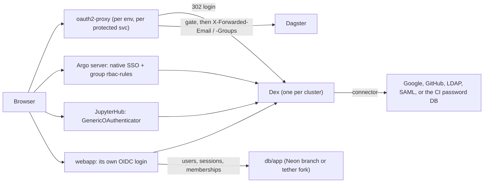

# Authentication and authorization

The platform runs several UIs that cannot authenticate on their own (Dagster
OSS, MLflow OSS, the Ray dashboard), two that can (Argo Workflows, JupyterHub),
and an application that should own its users. This document is the one place
that says how they are gated, where identity comes from, and which part of
that state belongs to an environment -- and so branches with a preview -- and
which does not.

## Three modes

`modules/workloads` takes `var.auth`:

| | `mode = "headers"` (default) | `mode = "oidc"` | `mode = "none"` |
| --- | --- | --- | --- |
| Who authenticates | the private network: a proxy that already knows the caller (the Tailscale operator's Ingress sets `Tailscale-User-Login`) | OpenID Connect against one issuer | nobody |
| Deployed by the module | nothing | an `oauth2-proxy` per protected service, Argo SSO config, JupyterHub OIDC config, the webapp's `OIDC_*` env, the OAuth2 clients | nothing |
| Portability | needs a network whose edge identifies users | any network, any IngressClass (Tailscale included) | -- |
| Per-service authorization | the network ACL (tags per Ingress) | `protect[svc]` gates, Argo `rbac-rule`s, JupyterHub `allowed_groups` | -- |

The mode is one switch that means the same thing everywhere. The webapp
receives it as `AUTH_MODE` and accepts exactly that mode's identity source:
the header named in `IDENTITY_HEADER` in `headers` mode, its own login in
`oidc` mode (or, when it sits behind an oauth2-proxy, the proxy's signed ID
token), nothing in `none` mode. A header the module has not named is never
trusted, and in `oidc` or `none` mode no header is. JupyterHub follows the
mode too (`jupyterhub_auth_mechanism` defaults to `oidc` in `oidc` mode and is
an override otherwise).

A public webapp Ingress is refused in `headers` mode: the public load
balancer passes whatever headers an internet client sends, so the tailnet's
identity header would identify anyone as anyone. A public webapp runs `oidc`
(it logs users in itself) or `none`.

## The pieces in `oidc` mode

**Dex is the issuer** ([`modules/dex`](../modules/dex)). It owns no users;
its connectors delegate the actual login to whatever you already run and
re-issue standard OIDC tokens. That hop buys two things: vendor neutrality
(swap the connector, nothing downstream changes) and dynamic clients. Google's
OAuth client has a static redirect-URI list, so a per-PR environment with
hostnames like `pr7-dagster.<suffix>` could never register with Google
directly; with Dex's `kubernetes` storage a client is an `OAuth2Client`
custom resource, which each environment creates for itself and deletes with
its `tofu destroy`. Connector secrets reach Dex as environment variables from
a Secret (`connector_env`, or `connector_env_secret_name` for one created
outside tofu), referenced as `$NAME` in the connector config, so they are
never in the Helm values or Dex's rendered config.

**oauth2-proxy is the relying party for services that cannot be one.** One
Deployment per protected service, in reverse-proxy mode: the private Ingress
points at the proxy, the proxy runs the login, enforces the service's gate
and forwards to the upstream with `X-Forwarded-Email`, `X-Forwarded-User`,
`X-Forwarded-Groups`. Because it is in the request path rather than a
forward-auth hook, it works behind any IngressClass and without any Ingress
at all (the kind example reaches the proxies by their in-cluster Service
URLs). Its sessions:

- **host-only cookies** -- no shared cookie domain. On a flat tailnet one
  environment's hosts sit beside every other's (`pr7-dagster.<suffix>` next
  to `dagster.<suffix>`), so any domain that covered one environment's
  proxies would carry prod's session cookie to every preview, which serves
  PR code.
- **re-validated hourly, at most a day long** (`session_refresh = "1h"`,
  `session_lifetime = "24h"`): the proxy asks Dex for `offline_access` and
  refreshes, re-reading groups, so removing someone from a group takes
  effect within the hour rather than oauth2-proxy's week-long default. Dex's
  ID tokens last an hour (`id_token_expiry`). A refresh that fails -- the
  user disabled, their upstream session over -- ends the session when the ID
  token it holds expires, not on the spot: Dex reports the upstream's refusal
  as a server error, which oauth2-proxy treats as transient.

**Services that speak OIDC talk to Dex directly.** Argo's server runs
`authModes: [sso]`; JupyterHub's `GenericOAuthenticator` gets the issuer's
`/auth`, `/token`, `/userinfo`; the webapp receives `OIDC_ISSUER_URL`,
`OIDC_CLIENT_ID`, `OIDC_CLIENT_SECRET`, `OIDC_REDIRECT_URL`, `OIDC_GROUPS_CLAIM`,
`OIDC_SCOPES`, `SESSION_SECRET` and `COOKIE_SECURE`, and runs the
authorization-code flow itself (with PKCE, a verified email required, users
keyed by issuer and subject). If the webapp is itself behind an oauth2-proxy
(`protect.webapp`), the proxy forwards its ID token (`Authorization: Bearer`)
and the app verifies it against Dex's keys (`IDENTITY_JWT_ISSUER`,
`IDENTITY_JWT_AUDIENCE`) -- the signed-assertion pattern of IAP or an ALB --
so its identity does not rest on the network path.

**A user store behind Dex.** [`modules/keycloak`](../modules/keycloak) and
[`modules/keycloak-realm`](../modules/keycloak-realm) put Keycloak in Dex's
connector slot: Keycloak holds the users, the tenants as group subtrees and
the delegated admins, and brokers the upstream logins (Google, GitHub, any
OIDC); Dex keeps issuing to every service, with Keycloak's full-path groups
(`/lab/authors`) in its tokens. [docs/tenancy.md](tenancy.md) has the model.
Two things about Keycloak itself: a first login is linked to an existing
account by email only for providers that opt in (`link_existing_by_email`,
off by default) -- whoever controls such a provider becomes any account it
can assert an address for, so it is for your own Workspace, never a tenant's
IdP -- and its admin console is not published with the logins: the public
Ingress serves the platform realm (`/realms/lab`) and `/resources`, never the
master realm; the console lives on `admin_hostname`, and tofu configures the
realm as a master-realm service account rather than an admin user (the
module README has the recovery path if that client is lost). Keycloak's
database is the one piece of auth state tofu cannot rebuild (memberships set
at runtime, which upstream login is which account): give it point-in-time
recovery.

Keycloak's session is what every refresh rides on: Dex's refresh tokens from
the realm are online ones and end with the realm's SSO session, so the
realm keeps a login alive for `sso_session_idle_timeout` (4h) unused and
`sso_session_max_lifespan` (24h) at most -- above oauth2-proxy's hourly
refresh, where Keycloak's 30-minute default would send users back to log in.
A provider whose emails the realm does not trust (`trust_email = false`, the
default for generic OIDC) needs `smtp` and `verify_email`: Dex refuses
unverified addresses, so without Keycloak's own verification its users
cannot log in.

**Single sign-on is per issuer session, not per cookie.** Dex keeps no
browser session in any release yet (its auth-sessions work, with per-client
`ssoSharedWith`, merged in March-April 2026 after v2.45.1): each relying
party's login goes back to the connector, and is silent when the upstream
has a session of its own -- which is what Keycloak provides: logged in once,
every other service's login bounces through Keycloak without a prompt.
(Dex's password DB keeps none.) When a Dex release ships sessions, enabling
them is a config change here, not a redesign.

**MLflow can log users in itself** (`auth.mlflow_mode = "oidc"`): the
chart's mlflow-oidc-auth plugin replaces the proxy, with per-experiment
permissions -- `mlflow_groups` may log in, `superadmin_group` administers,
everyone else starts at NO_PERMISSIONS until a permission or a
`mlflow_group_rules` pattern grants it. In-cluster clients authenticate as
MLflow service accounts whose tokens `mlflow-auth-sync` keeps in an
`mlflow-credentials` Secret per client. The sync job itself holds no MLflow
credential: it presents its projected ServiceAccount token, which the
plugin's Kubernetes provider accepts from MLflow's namespace only (issuer
`kubernetes_service_account_issuer`, audience MLflow's in-cluster URL), and
an init container in MLflow's pod -- the one place with the plugin's
database -- keeps that account an admin. Nothing to mint, store or renew,
and nobody's personal token behind the automation.

## Authorization: groups, default-deny

Every gate names who it admits; nothing admits "anyone the issuer admits"
unless you say so:

| Where | Input | Effect |
| --- | --- | --- |
| a proxied UI | `protect = { dagster = { allowed_groups = ["pipelines"] } }` | only members of `pipelines` open Dagster. A gate with neither groups nor emails needs `allowed_email_domains` (empty by default, so an ungated service fails the plan); `["*"]` is the explicit "everyone the issuer admits", right only when its connectors are restricted (a GitHub connector without `orgs` admits all of GitHub) |
| Argo | `argo_rbac_rules = { admins = { rule = "'platform' in groups", access = "write", precedence = 10 }, lab = { rule = "'lab' in groups", access = "read" } }` | one ServiceAccount per rule, annotated `workflows.argoproj.io/rbac-rule` and `-precedence`, bound to the `read` or `write` Role. Argo tries the numerically highest precedence first, so broad rules get low numbers. No implicit catch-all: a user matching no rule gets no Argo, and SSO requires at least one rule |
| JupyterHub | `jupyterhub_allowed_groups = ["lab"]` (or `jupyterhub_allowed_users`) | `allowed_groups` + `claim_groups_key` on the authenticator; `jupyterhub_allow_all = true` is the explicit open door |
| the webapp | its own tables | `require_group(...)` dependencies, group-filtered queries -- see the template app |

Groups arrive as a claim (`groups_claim`, default `groups`) that Dex forwards
when its connector can supply one: GitHub teams and LDAP / SAML / Microsoft
groups out of the box; Google only with an Admin SDK service account
configured on the connector; Dex's local password DB never. The `mockCallback`
connector returns a fixed identity in group `authors`, which is how the kind
smoke test proves a group gate end to end without an external IdP.

## The fence: the gate must be the way in

A gate means nothing if a caller can go around it, and inside a cluster
there are callers: notebook users run arbitrary code, and a preview runs a
PR's. So `network_policies` (on by default, both modes) puts a NetworkPolicy
in each UI service's namespace:

- the service's own pods accept traffic from their namespace, from the
  services that legitimately call them (by the `lab-platform.io/service`
  namespace label, in any environment: Dagster from the webapp; MLflow from
  the webapp, Dagster, Ray, Argo, JupyterHub; Ray from Dagster and Argo, plus
  the KubeRay operator; Argo from the webapp), and -- only when the service
  has no login proxy -- from the ingress controller's namespaces
  (`ingress_namespaces`, default the Tailscale operator's `tailscale`);
- a login proxy accepts traffic only from the ingress controller's
  namespaces.

So in `headers` mode only the tailnet Ingress can hand the webapp an
identity header, and in `oidc` mode a proxied service is reachable from
outside its callers only through its proxy. Clients are matched by label so
an app-only preview's webapp still reaches prod's Dagster -- the documented
stamp-or-share trade-off. A NetworkPolicy is inert unless the CNI enforces
it: kind's kindnet does (the smoke test asserts the refusals); on EKS the
VPC CNI's policy agent does, which `aws/eks-platform`'s `enable_network_policy`
turns on by default. Turning it on for an existing cluster makes the policies
bite at once, so check first that `ingress_namespaces` names your ingress
namespace.

## What is state, and where it lives

| State | Lives in | Branches with a preview? |
| --- | --- | --- |
| identity: who exists, how they prove it, which groups they are in | the upstream IdP, behind Dex | no, and it must not -- a preview should not contain different people |
| Dex's own records (clients, refresh tokens, signing keys) | Dex's CRDs | no; the environment's clients are **stamped** with it and deleted on destroy |
| proxy sessions | an encrypted, host-only cookie | no state |
| Argo rbac ServiceAccounts, JupyterHub allowed lists, proxy gates, NetworkPolicies | the environment's Kubernetes objects | stamped per environment |
| Keycloak's users, groups, tenant tree, admin permissions | Keycloak's own database | no: identity is global. Its structure (tenants, admin groups, superadmins) is in tofu; memberships below the admins are runtime state |
| users, memberships, app-managed groups, record ownership, roles | the webapp's database (`db/app`) | **yes** -- a Neon branch (tofu) or a tether fork; preview signups and permission experiments never touch prod |
| MLflow permissions (users, groups, patterns) | the MLflow database, schema `mlflow_auth` | **yes**, with the experiments they govern |
| notebook / tenant-compute roles `nb_<tenant>__<group>` | the Postgres server | created per environment (`modules/postgres-group-roles`). A Neon branch copies them **with their passwords** (roles made by SQL are data to Neon; only its own roles get new passwords, and only on protected parents), so prod's notebook credentials would open every preview branch; the template's preview-up turns their logins off on the branch |
| the webapp's login sessions | the webapp's database | **a hazard of branching, neutralized**: a preview's branch starts with prod's rows, prod's live sessions included, in a database PR code can read. The app stores only `HMAC(SESSION_SECRET, id)`, and each environment has its own `SESSION_SECRET`, so the copies cannot log anyone in to the preview or, replayed, to prod; preview-up also deletes them right after migrating |

This is the same split Neon draws with its Managed Better Auth: the auth
*schema* branches with the database while the social providers behind it do
not. The one thing Better Auth can additionally branch -- password hashes --
is deliberately not replicated here: the platform is SSO-only, Dex's password
DB exists for CI, and a self-contained user store (Zitadel, Keycloak) would
take Dex's slot rather than change the rest of the design.

## Trust between environments

Per-environment clients are a boundary only if an environment cannot write
another's. Registration needs write access to Dex's namespace, so a
preview's CI could, by design, rewrite prod's `OAuth2Client` redirect URIs.
`modules/dex`'s `client_admission` closes that with a ValidatingAdmissionPolicy:
requests from the restricted principals (the preview role's Kubernetes
username prefix or group) may only create, change or delete clients whose id
matches `allowed_id_pattern` (`^preview-`), checked on both the new and the
old object. The kind smoke test impersonates such a principal and asserts
both outcomes.

That fences the auth objects, and on its own it does not make a
cluster-admin preview role safe: a role that can do anything can also delete
the policy. `modules/preview-access` scopes the role itself. It is an admin
only in namespaces starting with its prefix (on EKS, an access entry whose
policy is scoped to `preview-*`); outside them it may create only its
namespaces, NodePools and EC2NodeClasses, which a second admission policy
holds to the same prefix, plus the clients above in Dex's namespace. A
preview identity scoped that way can touch neither policy. On the AWS side the preview role is
already fenced: IAM under `/preview/` only, every role it makes capped by a
permissions boundary ([preview-environments.md](preview-environments.md),
"Trust").

## Dex and Keycloak, or Keycloak alone

Keycloak can be the issuer by itself. Dex stays in front because it keeps
what the environments rely on: per-environment clients as `OAuth2Client`
custom resources that a preview creates and destroys with itself (Keycloak's
clients are realm objects behind an admin API), one issuer URL for every
service whatever the user store is, and `client_admission`. The cost is one
more hop and a second place to look when a login fails. Keycloak alone is
reasonable for a platform without previews.

## Choosing an issuer

- **Dex** (recommended): one per cluster, `enable_password_db` for CI, a
  connector for your IdP in production, `dex_namespace` set on every
  environment so clients are registered automatically.
- **Any other OIDC issuer** (Google directly, Okta, Keycloak): set
  `issuer_url`, leave `dex_namespace` empty and bring `clients` for each
  relying party (`oauth2-proxy`, `argo`, `jupyterhub`, `webapp`), registered
  with the redirect URIs `output.auth` prints. Drop `groups` from `scopes` for
  issuers that reject it. Per-preview environments are impractical this way
  for the redirect-URI reason above.

The issuer URL must be the same string from a browser and from a pod: on
kind the in-cluster Service URL serves both; on a real cluster give Dex an
Ingress hostname that pods can also resolve.

## Where the network still matters

`oidc` mode makes authentication independent of the network, which is what
makes the network swappable later (Headscale, NetBird, plain ingress-nginx on
a public cluster). It does not remove the reason to have a private network:
Kubernetes API access, databases and object stores are still reached over it,
and in `headers` mode the tailnet's ACL remains a perfectly good gate.

**A tailnet-only issuer.** Put Dex (and Keycloak) behind the private
Ingress (`ingress = { enabled = true, class_name = "tailscale", host = "dex" }`,
issuer `https://dex.<tailnet>.ts.net/dex`) and let pods resolve tailnet names
the way browsers do: `aws/eks-platform`'s `enable_tailscale_dnsconfig` runs
the operator's DNSConfig nameserver behind a Service at a ClusterIP you
choose (`tailscale_nameserver_cluster_ip`) and adds a CoreDNS stub zone for
`ts.net` forwarding to it, so the proxies, Argo, MLflow and the webapp reach
the issuer at the same URL. Moving between private and public is then a
change of Ingress and issuer URL, not of design.

**Status.** `oidc` mode, Keycloak and the tenants have run end to end on
kind (the smoke test), not yet on EKS. Before relying on them in production,
run them on a sandbox cluster, including the tailnet-only issuer above;
until then `headers` is the production mode on a tailnet.
