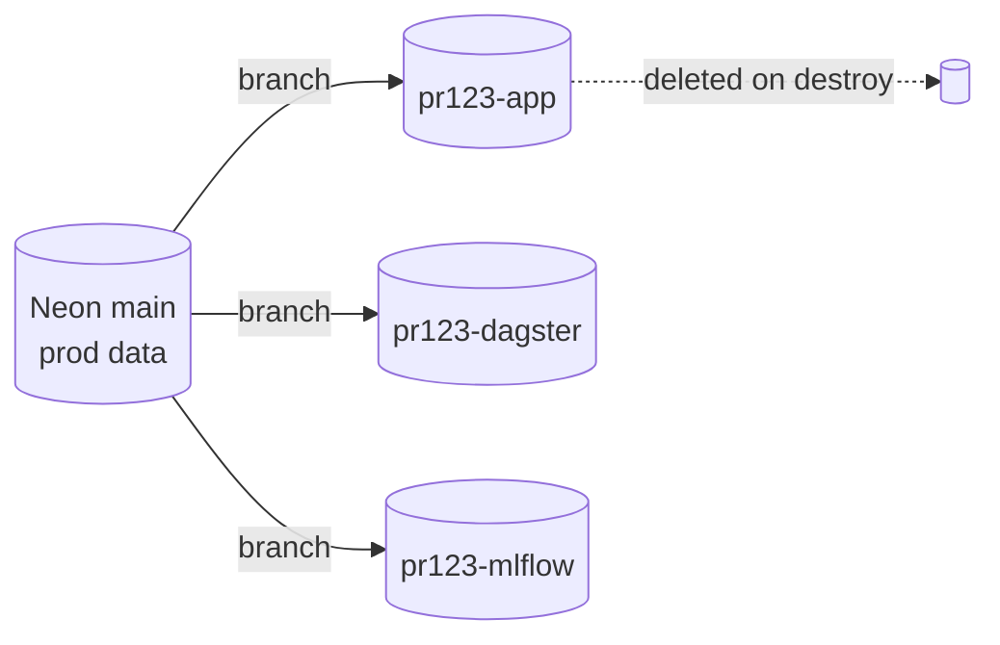
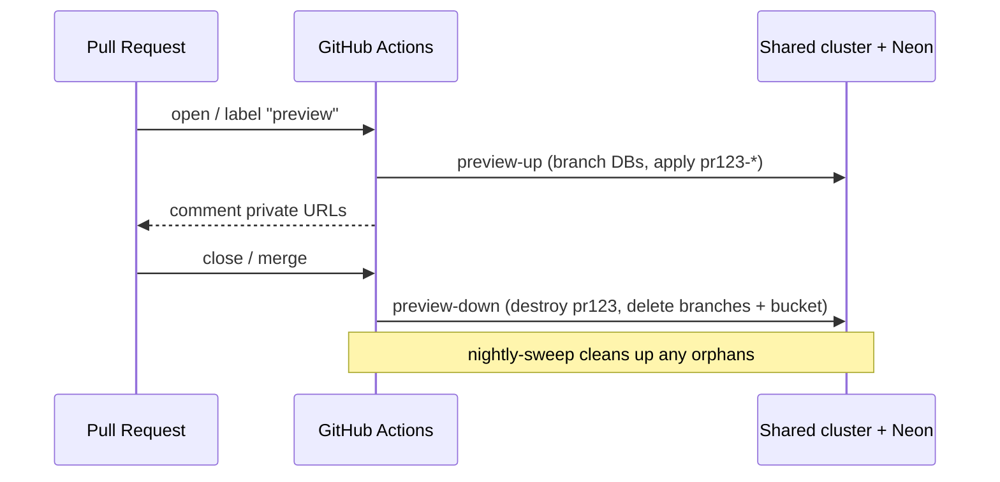

# Preview environments

The headline feature of this module family: **branch prod for testing, off
prod.** Every pull request can stand up a full, production-like copy of the
platform's workloads, run against copy-on-write clones of the production
databases, and tear the whole thing down when the PR closes — without ever
touching prod's namespaces, data, or IAM.

What "branch prod" covers, precisely:

- **Postgres** -- the app's database and the services' own -- is a real
  copy-on-write branch of prod's (Neon), migrated to the PR's schema.
- **Object stores and Iceberg tables** start **empty** by default (`tofu`
  mode): a fresh bucket and namespace per preview. Prod's bytes are not there.
- Forking those stores too is opt-in (`tether` mode), and it happens **inside
  prod's stores**: the preview's pods get write access to prod buckets and
  commit access to prod tables, which IAM cannot narrow to a branch
  ([Ephemeral data](#ephemeral-data-two-providers)). Use it only where the
  PR's code is trusted with that.

**Status.** The modules are plan-tested and the auth path runs end to end on
kind. A reference deployment runs the template app's preview loop end to end
on EKS in both data modes, tofu and tether. [Trust](#trust-what-a-preview-can-reach)
lists what a preview can and cannot reach.

This document explains how it works so you can adopt, extend, or replace the
pieces.

## The core idea: shared substrate, stamped workloads

The expensive, slow-to-provision things are created **once** and **shared**:

- the EKS **control plane** and its operators (Karpenter, the Load Balancer
  Controller, the Tailscale operator, monitoring);
- the **VPC**, NAT gateways, and the Tailscale subnet router;
- the KubeRay / Argo controllers.

The cheap, fast, per-PR things are **stamped** with a unique `name_prefix` (e.g.
`pr123-`) and applied on top of that shared substrate:

- namespaces (`pr123-webapp`, `pr123-dagster`, …),
- IAM roles / policies and Karpenter NodePools,
- Helm releases and private hostnames,
- a copy-on-write database branch per source,
- an ephemeral S3 bucket.

Because the cluster is shared, a preview only pays for the **pods and nodes it
actually schedules** — there is no second control plane, no second VPC, no
second NAT bill.

| Concern         | Prod                     | Preview `pr123`                                    |
| --------------- | ------------------------ | -------------------------------------------------- |
| Cluster         | shared EKS               | **same cluster**                                   |
| Namespaces      | `webapp`, `dagster`, …   | `pr123-webapp`, `pr123-dagster`, … (`name_prefix`) |
| IAM / NodePools | base names               | `pr123-`-stamped                                   |
| Database        | Neon `main`              | copy-on-write branch off `main`                    |
| Object storage  | prod bucket              | ephemeral `preview-processeddata-pr123`            |
| Ingress host    | `app.example.com`        | `pr123-webapp.<tailnet>.ts.net` (private)          |
| State           | `prod/…`                 | workspace `pr123` → `preview/pr123/…`              |

## The `name_prefix` contract

Everything the [`workloads`](../modules/workloads) module creates is derived from
`name_prefix`. Prod applies it with `name_prefix = ""` (base names); a preview
applies the *same module* with `name_prefix = "pr123-"`. That single input is
what guarantees two applies against one cluster never collide on a namespace,
Helm release name, IAM role name, or hostname.

`name_prefix` is validated against the **tightest** downstream limit (Kubernetes
namespace 63, IAM role name 64, ALB name 32 chars) rather than just a regex, so a
long prefix fails fast at plan time instead of producing an invalid name deep in
an apply.

## State layout: one workspace per PR

Each preview is an OpenTofu **workspace**, so its state is isolated:

```
s3://my-org-terraform-state/preview/pr123/terraform.tfstate
s3://my-org-terraform-state/preview/pr456/terraform.tfstate
```

The [`bootstrap`](../aws/bootstrap) preview role scopes state **writes** to
`preview/*`, so a preview apply can never mutate prod's state object. See
[`examples/preview/backend.tf.example`](../examples/preview/backend.tf.example)
for the `workspace_key_prefix` wiring.

## Data strategy: copy-on-write branches

A preview that runs against an empty database tells you nothing. The
[`neon-branches`](../modules/neon-branches) module cuts a **copy-on-write** child
branch off each production Neon branch (`main`) in seconds — the preview sees
prod's schema and data, and any writes it makes land on the branch, never on
prod. On destroy the branches are deleted.



**Migrations.** A branch carries `main`'s schema, not the PR's. If the PR adds a
migration, run it against the branch after apply (the branch role owns the DB, so
it has DDL rights). Preview pods may briefly crash-loop against the un-migrated
schema until the migration lands.

**Not using Neon?** Leave `neon_branch_sources` empty and pass your own
connection details. The generic fallback is an empty branched DB plus a migration
step; an Aurora fast-clone is the equivalent copy-on-write option on RDS.

## Storage strategy: ephemeral bucket

[`preview-storage`](../aws/preview-storage) creates one throwaway,
KMS-encrypted bucket per preview (`force_destroy = true`). The workloads route
both their processed-data writes **and MLflow artifacts** to it, so nothing a
preview produces is written into a prod bucket — a subtle but important
improvement over sharing the prod artifact store.

## Lakehouse strategy: ephemeral Iceberg namespace (optional)

If the platform keeps Iceberg tables in an S3 Tables bucket,
[`iceberg-branches`](../aws/iceberg-branches) gives each preview its own
**namespace** in that shared bucket, with IAM that confines the preview's
writes to its namespace and optionally allows read-only access to prod
namespaces. Toggle it in `examples/preview` via `iceberg_table_bucket_arn`.
True copy-on-write *branch refs* on prod tables are an engine-side operation
(pyiceberg one-liner in the module README), mirroring how Neon handles the
relational side in one API call.

## Two preview profiles: full, or app-only

A preview stamps whatever its `preview_profile` says
([`examples/preview`](../examples/preview); the template app maps it to a PR
label):

| | `full` (default) | `app` |
| --- | --- | --- |
| Webapp | the PR's image, its own namespace and **database branch** | same |
| Dagster, Ray, MLflow | stamped: the PR's code location, a Ray cluster, a tracking server, all isolated | **not stamped** -- the webapp points at prod's via `shared_service_urls` (prod's `in_cluster_urls` output) |
| Karpenter pools | the preview's own | none; rides the shared node group |
| Time to green | build two images, ~8-10 min | build one image, ~2 min |
| Tests | app and pipeline changes together | **the app only** |

The `app` profile is the right tool for a frontend or API change and the
wrong one for anything else, because of what "shared Dagster" means: runs the
preview's app triggers execute **prod's code location on prod's data and
prod's database**, while the preview's webapp reads its *own* branch. A
pipeline or schema change in such a PR is simply not exercised. The label
makes the choice visible on the PR; the profile is also what
`enable_x = false` + a `*_url` override on `modules/workloads` gives you by
hand (its README, "Stamp or share").

## Neon topology: projects and branches

A Neon branch is a snapshot of a whole project (every database on the parent,
at one instant) and a compute belongs to the branch. `modules/neon-branches`
therefore branches per (project, parent branch): three databases in one
project cost a preview **one** branch and one compute, three projects cost
three. Choose the prod layout on those terms. Per-service projects isolate
each service's connections, WAL/history window and Postgres upgrade — worth
it for Dagster, whose polling keeps its compute awake and whose event log pads
the project's history storage. Databases that should snapshot together and
have similar churn (the app, MLflow, the Argo archive) belong in one project,
so a preview of them is one coherent branch. Two projects, `data` and
`orchestration`, is the shape that gets both.

## Ephemeral data: two providers

The three modules above are one way to give a preview its data: Terraform
stamps an isolated, mostly **empty** copy — a copy-on-write Neon branch, a fresh
bucket, a fresh namespace — and tears it down with the stack. The other way is a
dataset tool that **forks the production stores themselves**:
[tether](https://github.com/Rosebud-Biosciences/tether) cuts a branch per preview in every
registered system (Neon, Icechunk, Iceberg, Lance), pins the baseline it forked
from, and can land the result back on prod. The two are alternatives selected
per deployment, not layers; the `lab-platform-template-app` shows both behind a
`fork_provider` toggle (`tofu`, the default, or `tether`).

| | `tofu` (this page so far) | `tether` |
| --- | --- | --- |
| Postgres -- the app's database and the services' own (Dagster run storage, MLflow tracking store, Argo workflow archive) | `neon-branches`: CoW branch per (project, parent), tuned compute | tether fork of the Neon project's branch (one branch serves every database), `--pin record` |
| Object stores (Icechunk, Lance, Delta) | fresh copies in the `preview-storage` bucket: **empty** | branches inside the prod stores, forked from the last pinned state |
| Iceberg | `iceberg-branches`: empty namespace, IAM-isolated | table branches on the prod tables |
| Which prod state was tested | not recorded | a pinned dataset commit per preview |
| Landing preview data on prod | never: prod recomputes with the merged code | never: the forks are discarded on merge or close, and prod recomputes with the merged code |
| Preview's access to prod data | none (writes are physically elsewhere) | write into prod buckets and commit to prod tables, no delete ([`data-access`](../aws/data-access)) |
| Dependencies | none | `tether-vcs` (beta; Neon and Iceberg backends `experimental`) |
| Teardown | `tofu destroy` | `tofu destroy`, then `tether gc --prune-bookmarks --force-prune` |

Two facts about the tether side belong next to any decision to use it. A fork of
an Iceberg table on S3 Tables is a branch on the **production** table, so the
preview's pods need commit rights IAM cannot scope to a branch — trust in the
code, audited by tether's operation log and `verify`, is the guard. And user refs
on an S3 Tables table suspend its automatic maintenance while they exist, so
forks are kept short-lived and swept.

**Service state is data too.** A stamped Dagster, MLflow or Argo Workflows is
only as useful as what it remembers, so a full preview gives each its own
branch of prod's database (`neon_branch_sources` keys `dagster`, `mlflow`,
`argo`; tether objects `db/dagster`, `db/mlflow`, `db/argo`) and the preview
opens with prod's Dagster run history and MLflow experiments visible -- and
writes none of it back. Prod's archived workflows are on the Argo branch too,
but unlisted: Argo keys its archive by namespace, and each environment's server
is scoped to its own (`<name_prefix>argo`), so a preview gets an archive of its
own rather than a view of prod's. Neon branches cannot be promoted, so nothing a
preview's services record ever lands on prod; that is the point. MLflow's
artifacts are the one non-branchable piece (write-once blobs; tether's
object-store backend has no fork): they go to a per-preview prefix -- the
ephemeral bucket in `tofu` mode, `<data bucket>/tether/mlflow/pr<N>/` in
`tether` mode -- that the teardown deletes.

**The contract both providers meet.** Application code never learns which
provider is in use. Pods receive:

- `DATABASE_URL` — the preview's Postgres (the `neon-branches` URL, or the URL
  tether's `open` prints for the fork), and each stamped service its own
  database's connection (`<svc>_db_*` inputs of `modules/workloads`).
- `DATA_REFS` — a JSON object `key -> address`, one entry per data object, in the
  address forms tether's `open --json` prints: `s3://.../x.icechunk#<branch>`,
  `<namespace>.<table>#<branch>`, `s3://.../x.lance#<branch>`, `s3://.../x.delta`
  (`@vN` for a read-only version), `s3://.../prefix/`. Terraform builds it from
  the ephemeral bucket and namespace in `tofu` mode; a CI job builds it from the
  forks in `tether` mode. Prod sets every ref to `#main` at the real locations.

Passing values a CI job minted (the fork's database URL) into the apply is what
the reusable workflows' `extra_tfvars_json` secret is for; the Dagster user-code
deployment receives `DATABASE_URL` and the caller's `dagster_user_code_env`
exactly as the webapp does, so the assets and the app read the same data.

## Trust: what a preview can reach

A preview runs the PR's code, and the preview role runs the PR's workflow: for
a branch of the repository (not a fork, which gets no OIDC token), whoever can
push it controls both. So the boundaries that matter are the ones that hold
against the PR itself:

- **IAM.** The preview role creates and changes roles and policies only under
  `preview_iam_path` (`/preview/`), which prod never uses, and only roles that
  carry the preview permissions boundary; it attaches only policies under
  that path. The boundary (`aws/bootstrap`) caps every preview role, whatever
  policy a PR writes, at object-level S3, the S3 Tables data plane, KMS data
  keys and ECR pulls -- no IAM, STS, compute or bucket configuration, and
  never the Terraform state bucket -- and at what a preview owns: its
  ephemeral bucket, its tagged key, its Iceberg namespace. Anything more is
  listed in `preview_boundary_access`, separately for reads, writes and
  deletes (tether mode: the data prefixes and prod tables are writable, only
  Lance working branches deletable). S3 grants are pinned to the account
  (`aws:ResourceAccount`), so a bucket of a matching name elsewhere is out of
  reach. A PR still writes its roles' trust policies; with
  `preview_boundary_federated_providers` set, a role session that did not
  come through the cluster's OIDC issuer is denied everything.
- **Terraform state.** The bucket also holds prod's state, which holds its
  secrets. The preview role reads only its workspaces' state
  (`preview_state_key_prefix`) and the objects named in
  `preview_state_read_keys` -- the preview stack's own default-workspace key,
  which `tofu init` reads first.
- **Kubernetes RBAC for workloads.** Dagster and Argo get Roles in their own
  environment's namespaces only: creating a pod or a RayCluster in a
  namespace is running as that namespace's ServiceAccounts, so nothing grants
  it cluster-wide.
- **The network.** `network_policies` keeps each UI reachable only through its
  gate. EKS enforces them only with the VPC CNI's policy agent
  (`aws/eks-platform` `enable_network_policy`, on by default); without it, in
  auth mode `headers`, any pod could reach the webapp and assert an identity.
- **Data.** `tofu` mode: the preview writes only its own copies. `tether`
  mode: write into prod stores, no delete (above); with `aws/data-access`'s
  `protect_trunk` on every policy a PR controls (its pods', its workflow's),
  never the trunk or its pins -- Lance's root versions and tags, Icechunk
  1.x's `main` ref and tags, Delta's log -- which the default branch's role
  alone writes (`data-pull`, `tether-matrix`). Iceberg and Icechunk 2.x stay
  exposed: each keeps every ref in one object (a table's metadata file, the
  repository's `repo`) that creating a branch rewrites. The bucket's
  versioning is the backstop.
- **`app` profile.** Its triggers run prod's Dagster on prod's data (above).
- **Kubernetes RBAC for the preview role.** With `aws/eks-platform`'s
  `preview_access` and the access entry it describes, the preview role is an
  admin only in namespaces starting with `preview-` (`modules/preview-access`),
  through a RoleBinding it creates in each (`modules/workloads`
  `namespace_admin`); outside them it creates only its namespaces, NodePools
  and EC2NodeClasses and those RoleBindings, which an admission policy holds
  to the prefix, and its Dex clients, which `client_admission` fences.
  Without them (up to v0.2.0) it deploys with a
  cluster-admin access entry: anyone who can push a branch to the app
  repository can change the cluster through its preview workflow (the label
  check is in a file the PR can edit).

## GPU isolation

Ray GPU workers select their nodes by NodePool. The preview stamps a
`pr123-ray-gpu-worker` NodePool and the Ray Helm values select it by the
prefixed name, so each preview gets **its own** GPU capacity instead of sharing
prod's pool (the one caveat that existed in the source setup).

## The CI loop

Three reusable workflows (`workflow_call`) in
[`.github/workflows`](../.github/workflows) wrap the apply/destroy/sweep loop and
assume the least-privilege preview role via GitHub OIDC:

- **`preview-up`** — `tofu workspace select -or-create pr123` then `apply`. Image
  builds are the caller's job (application-specific); pass the built tags in via
  `extra_apply_args`.
- **`preview-down`** — `destroy` the workspace and delete it. Removes the
  namespaced workloads, the Neon branches, and the ephemeral bucket in one shot.
- **`nightly-sweep`** — belt-and-braces: destroys any `prNNN` workspace whose PR
  is closed or merged, catching anything a missed `preview-down` left behind.



## Adoption checklist

1. Apply [`bootstrap`](../aws/bootstrap) (state backend + OIDC roles). An
   app repository created since 2026-07-15 needs its ID and its owner's in
   `github_repository_ids` / `github_owner_id` (GitHub's immutable OIDC
   subject; see the module README).
2. Stand up the shared platform (`network` + `eks-platform`), e.g. via
   [`examples/complete`](../examples/complete).
3. Copy [`examples/preview`](../examples/preview) into your app repo (or call it
   directly), wiring `cluster_name` / `oidc_provider_arn` / … from the platform
   stack's remote state into `aws/data-adapter` + `aws/compute-adapter`, whose
   outputs feed `modules/workloads`.
4. Add caller workflows that invoke the reusable `preview-up`/`preview-down`
   workflows, passing your freshly built image tags. While this platform repo
   is private, also pass `modules_git_token` (a fine-grained PAT or App token
   with read-only Contents on it): `tofu init` fetches `github.com/...`
   module sources with git, and a runner's own `GITHUB_TOKEN` reaches only
   the repository it runs in.
5. Point the preview role's `preview_state_key_prefix` and ephemeral bucket
   pattern at whatever your naming actually is, and pass `aws/bootstrap`'s
   `preview_iam_path` and `preview_permissions_boundary_arn` outputs to the
   preview stack (`examples/preview` inputs of the same names): the preview
   role creates no IAM outside that path, and no role without the boundary.
   If the preview stack's backend `key` lies outside
   `preview_state_key_prefix` (the template's `template-app/terraform.tfstate`
   does), list it in `preview_state_read_keys`: `tofu init` reads it, and the
   role reads no other state.
