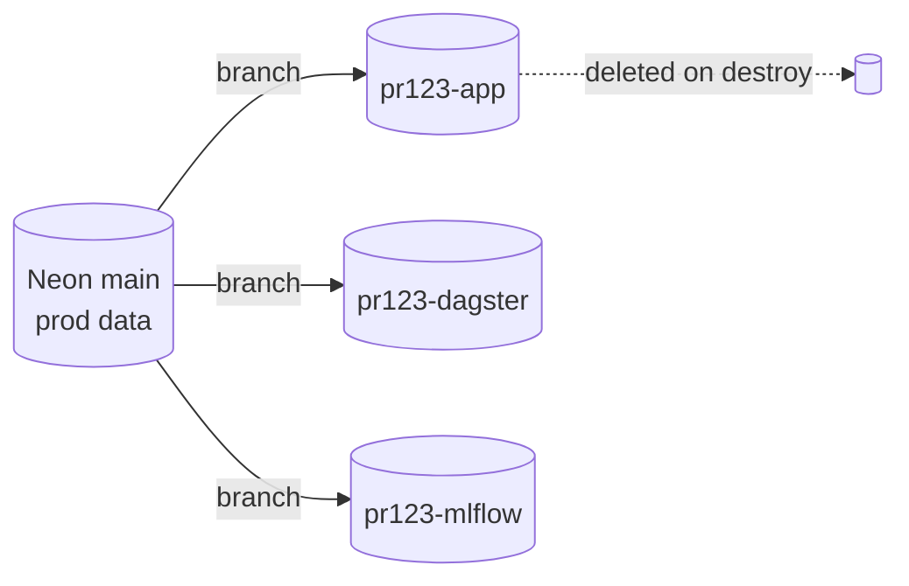
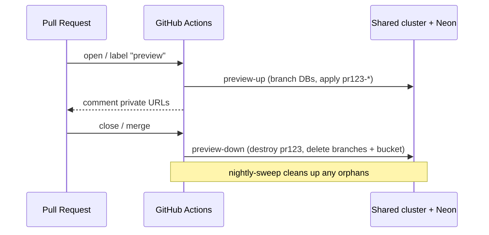

# Preview environments

The headline feature of this module family: **branch prod for testing, off
prod.** Every pull request can stand up a full, production-like copy of the
platform's workloads, run against copy-on-write clones of the production
databases, and tear the whole thing down when the PR closes — without ever
touching prod's namespaces, data, or IAM.

This document explains how it works so you can adopt, extend, or replace the
pieces.

## The core idea: shared substrate, stamped workloads

The expensive, slow-to-provision things are created **once** and **shared**:

- the EKS **control plane** and its operators (Karpenter, the Load Balancer
  Controller, the Tailscale operator, monitoring);
- the **VPC**, NAT gateways, and the Tailscale subnet router;
- the KubeRay / Argo controllers.

The cheap, fast, per-PR things are **stamped** with a unique `name_prefix` (e.g.
`pr123-`) and applied on top of that shared substrate:

- namespaces (`pr123-webapp`, `pr123-dagster`, …),
- IAM roles / policies and Karpenter NodePools,
- Helm releases and private hostnames,
- a copy-on-write database branch per source,
- an ephemeral S3 bucket.

Because the cluster is shared, a preview only pays for the **pods and nodes it
actually schedules** — there is no second control plane, no second VPC, no
second NAT bill.

| Concern         | Prod                     | Preview `pr123`                                    |
| --------------- | ------------------------ | -------------------------------------------------- |
| Cluster         | shared EKS               | **same cluster**                                   |
| Namespaces      | `webapp`, `dagster`, …   | `pr123-webapp`, `pr123-dagster`, … (`name_prefix`) |
| IAM / NodePools | base names               | `pr123-`-stamped                                   |
| Database        | Neon `main`              | copy-on-write branch off `main`                    |
| Object storage  | prod bucket              | ephemeral `preview-processeddata-pr123`            |
| Ingress host    | `app.example.com`        | `pr123-webapp.<tailnet>.ts.net` (private)          |
| State           | `prod/…`                 | workspace `pr123` → `preview/pr123/…`              |

## The `name_prefix` contract

Everything the [`workloads`](../modules/workloads) module creates is derived from
`name_prefix`. Prod applies it with `name_prefix = ""` (base names); a preview
applies the *same module* with `name_prefix = "pr123-"`. That single input is
what guarantees two applies against one cluster never collide on a namespace,
Helm release name, IAM role name, or hostname.

`name_prefix` is validated against the **tightest** downstream limit (Kubernetes
namespace 63, IAM role name 64, ALB name 32 chars) rather than just a regex, so a
long prefix fails fast at plan time instead of producing an invalid name deep in
an apply.

## State layout: one workspace per PR

Each preview is an OpenTofu **workspace**, so its state is isolated:

```
s3://my-org-terraform-state/preview/pr123/terraform.tfstate
s3://my-org-terraform-state/preview/pr456/terraform.tfstate
```

The [`bootstrap`](../aws/bootstrap) preview role scopes state **writes** to
`preview/*`, so a preview apply can never mutate prod's state object. See
[`examples/preview/backend.tf.example`](../examples/preview/backend.tf.example)
for the `workspace_key_prefix` wiring.

## Data strategy: copy-on-write branches

A preview that runs against an empty database tells you nothing. The
[`neon-branches`](../modules/neon-branches) module cuts a **copy-on-write** child
branch off each production Neon branch (`main`) in seconds — the preview sees
prod's schema and data, and any writes it makes land on the branch, never on
prod. On destroy the branches are deleted.



**Migrations.** A branch carries `main`'s schema, not the PR's. If the PR adds a
migration, run it against the branch after apply (the branch role owns the DB, so
it has DDL rights). Preview pods may briefly crash-loop against the un-migrated
schema until the migration lands.

**Not using Neon?** Leave `neon_branch_sources` empty and pass your own
connection details. The generic fallback is an empty branched DB plus a migration
step; an Aurora fast-clone is the equivalent copy-on-write option on RDS.

## Storage strategy: ephemeral bucket

[`preview-storage`](../aws/preview-storage) creates one throwaway,
KMS-encrypted bucket per preview (`force_destroy = true`). The workloads route
both their processed-data writes **and MLflow artifacts** to it, so nothing a
preview produces is written into a prod bucket — a subtle but important
improvement over sharing the prod artifact store.

## Lakehouse strategy: ephemeral Iceberg namespace (optional)

If the platform keeps Iceberg tables in an S3 Tables bucket,
[`iceberg-branches`](../aws/iceberg-branches) gives each preview its own
**namespace** in that shared bucket, with IAM that confines the preview's
writes to its namespace and optionally allows read-only access to prod
namespaces. Toggle it in `examples/preview` via `iceberg_table_bucket_arn`.
True copy-on-write *branch refs* on prod tables are an engine-side operation
(pyiceberg one-liner in the module README), mirroring how Neon handles the
relational side in one API call.

## Ephemeral data: two providers

The three modules above are one way to give a preview its data: Terraform
stamps an isolated, mostly **empty** copy — a copy-on-write Neon branch, a fresh
bucket, a fresh namespace — and tears it down with the stack. The other way is a
dataset tool that **forks the production stores themselves**:
[tether](https://github.com/elyall/tether) cuts a branch per preview in every
registered system (Neon, Icechunk, Iceberg, Lance), pins the baseline it forked
from, and can land the result back on prod. The two are alternatives selected
per deployment, not layers; the `lab-platform-template-app` shows both behind a
`fork_provider` toggle (`tofu`, the default, or `tether`).

| | `tofu` (this page so far) | `tether` |
| --- | --- | --- |
| Postgres | `neon-branches`: CoW branch, tuned compute | tether fork of the Neon project's branch (one branch serves every database), `--pin record` |
| Object stores (Icechunk, Lance, Delta) | fresh copies in the `preview-storage` bucket: **empty** | branches inside the prod stores, forked from the last pinned state |
| Iceberg | `iceberg-branches`: empty namespace, IAM-isolated | table branches on the prod tables |
| Which prod state was tested | not recorded | a pinned dataset commit per preview |
| Landing preview data on prod | not possible | `tether promote` for Icechunk / Iceberg (fast-forward); recompute for the rest |
| Preview's access to prod data | none (writes are physically elsewhere) | write into prod buckets and commit to prod tables, no delete ([`data-access`](../aws/data-access)) |
| Dependencies | none | `tether-vcs` (beta; Neon and Iceberg backends `experimental`) |
| Teardown | `tofu destroy` | `tofu destroy`, then `tether gc --prune-bookmarks --force-prune` |

Two facts about the tether side belong next to any decision to use it. A fork of
an Iceberg table on S3 Tables is a branch on the **production** table, so the
preview's pods need commit rights IAM cannot scope to a branch — trust in the
code, audited by tether's operation log and `verify`, is the guard. And user refs
on an S3 Tables table suspend its automatic maintenance while they exist, so
forks are kept short-lived and swept.

**The contract both providers meet.** Application code never learns which
provider is in use. Pods receive:

- `DATABASE_URL` — the preview's Postgres (the `neon-branches` URL, or the URL
  tether's `open` prints for the fork).
- `DATA_REFS` — a JSON object `key -> address`, one entry per data object, in the
  address forms tether's `open --json` prints: `s3://.../x.icechunk#<branch>`,
  `<namespace>.<table>#<branch>`, `s3://.../x.lance#<branch>`, `s3://.../x.delta`
  (`@vN` for a read-only version), `s3://.../prefix/`. Terraform builds it from
  the ephemeral bucket and namespace in `tofu` mode; a CI job builds it from the
  forks in `tether` mode. Prod sets every ref to `#main` at the real locations.

Passing values a CI job minted (the fork's database URL) into the apply is what
the reusable workflows' `extra_tfvars_json` secret is for; the Dagster user-code
deployment receives `DATABASE_URL` and the caller's `dagster_user_code_env`
exactly as the webapp does, so the assets and the app read the same data.

## GPU isolation

Ray GPU workers select their nodes by NodePool. The preview stamps a
`pr123-ray-gpu-worker` NodePool and the Ray Helm values select it by the
prefixed name, so each preview gets **its own** GPU capacity instead of sharing
prod's pool (the one caveat that existed in the source setup).

## The CI loop

Three reusable workflows (`workflow_call`) in
[`.github/workflows`](../.github/workflows) wrap the apply/destroy/sweep loop and
assume the least-privilege preview role via GitHub OIDC:

- **`preview-up`** — `tofu workspace select -or-create pr123` then `apply`. Image
  builds are the caller's job (application-specific); pass the built tags in via
  `extra_apply_args`.
- **`preview-down`** — `destroy` the workspace and delete it. Removes the
  namespaced workloads, the Neon branches, and the ephemeral bucket in one shot.
- **`nightly-sweep`** — belt-and-braces: destroys any `prNNN` workspace whose PR
  is closed or merged, catching anything a missed `preview-down` left behind.



## Adoption checklist

1. Apply [`bootstrap`](../aws/bootstrap) (state backend + OIDC roles).
2. Stand up the shared platform (`network` + `eks-platform`), e.g. via
   [`examples/complete`](../examples/complete).
3. Copy [`examples/preview`](../examples/preview) into your app repo (or call it
   directly), wiring `cluster_name` / `oidc_provider_arn` / … from the platform
   stack's remote state into `aws/data-adapter` + `aws/compute-adapter`, whose
   outputs feed `modules/workloads`.
4. Add caller workflows that invoke the reusable `preview-up`/`preview-down`
   workflows, passing your freshly built image tags. While this platform repo
   is private, also pass `modules_git_token` (a fine-grained PAT or App token
   with read-only Contents on it): `tofu init` fetches `github.com/...`
   module sources with git, and a runner's own `GITHUB_TOKEN` reaches only
   the repository it runs in.
5. Point the preview role's `preview_state_key_prefix`, IAM name patterns, and
   ephemeral bucket pattern at whatever your naming actually is.
