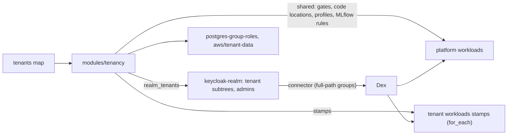

# Tenancy: groups, admins, and who runs where

The platform serves more than one group of people: the lab's own teams, and
possibly other organizations with their own data. This document says how
they are modelled (one user store, tenants as group subtrees), who may
administer whom, and how each tenant is placed on shared or isolated
backends per service -- with the plan failing when a placement cannot keep a
tenant to itself.

## The model

- **Identity** is Keycloak ([`modules/keycloak`](../modules/keycloak)) behind
  Dex ([`modules/dex`](../modules/dex)): Keycloak holds users and groups and
  brokers upstream logins (Google, GitHub, any OIDC); Dex stays the issuer
  every service trusts, with Keycloak as its connector. Private versus public
  is only a matter of where the issuer and the UIs are exposed.
- **Tenants** are top-level groups in one realm
  ([`modules/keycloak-realm`](../modules/keycloak-realm)); a tenant's groups
  are its subgroups, and tokens carry full paths (`/acme/research`). Slugs are
  `^[a-z][a-z0-9_]{0,20}$` without `__`; `admins` is reserved.
- **Admins**, three levels:

  | Group | May |
  | --- | --- |
  | `/platform-admins` | everything (realm-admin, and `auth.superadmin_group` everywhere). Membership is authoritative in tofu: repo access is the power to make superadmins |
  | `/<tenant>/admins` | manage the tenant's members: their accounts, and who is in each of the tenant's groups (including who administers them) |
  | `/<tenant>/<group>/admins` | add and remove members of that group (and its admins) |

  Delegation is Keycloak's fine-grained admin permissions v2, shaped by two
  rules of its evaluation: every permission covering a group must grant
  (so no two permissions cover a group with different policies), and
  `manage-membership` never cascades to subgroups. So: one permission on
  `/<tenant>` and `/<tenant>/admins` for the tenant's admins (its member
  scopes cascade to the tenant's groups), one permission per group whose
  single policy admits the group's admins or the tenant's, and one realm-wide
  user permission (adding someone to a group needs `manage-group-membership`
  on the user *and* `manage-membership` on the group, so the group
  permission is the fence). With `admins_can_view_all_users` (default)
  admins can look up any user of the realm -- they need to, to add someone
  new -- but change memberships only of their own groups. Memberships below
  the admins are runtime state, changed in Keycloak's console or API.

  **Groups themselves are the tenants map's.** Keycloak gives a group
  created at runtime no permissions at all (keycloak/keycloak#29100), so a
  tenant admin who created one could not manage its members, and a
  catch-all "all groups" permission would reach across tenants. Nobody gets
  Keycloak's `manage` scope on groups; a new group is a line in the tenants
  map, applied like any other change.
- **Backends**: [`modules/tenancy`](../modules/tenancy) takes one map of
  tenants and places each tenant per service: `shared` (the platform's
  instance, isolated inside where the service can), `isolated` (the tenant's
  own stamp of `modules/workloads`), or `off`.
- **Data**: row-level security on the app's tables; the webapp queries as
  `app_reader` with the caller's groups, notebooks and tenant compute connect
  as `nb_<tenant>__<group>` ([`modules/postgres-group-roles`](../modules/postgres-group-roles));
  objects in a prefix of the shared bucket or a bucket of the tenant's own,
  reached through the tenant's role ([`aws/tenant-data`](../aws/tenant-data)).



## What a shared instance can isolate

| Service | `shared` isolates tenants? | How, when shared |
| --- | --- | --- |
| webapp | yes | row-level security + app-managed groups (the template app) |
| JupyterHub | yes | a server profile per group (`jupyterhub_group_profiles`): the group's ServiceAccount (cloud role), its DB role, its directory on the home volume, labels its stamps admit; external tenants without the hub-wide `/home/shared` |
| MLflow | yes, with `auth.mlflow_mode = "oidc"` | per-experiment permissions: each tenant's groups EDIT (its admins MANAGE) experiments named `<tenant>/...`; its compute uses service account `svc-<tenant>` |
| Dagster OSS | compute only | a code location per tenant (`dagster_code_locations`) running, and launching runs, as the tenant's identity; the UI, run history, logs and asset catalog are visible to everyone who can open Dagster |
| Ray, Argo (as built) | no | one identity per instance |

`trust = "external"` tenants may only be `shared` on "yes" rows (MLflow
only on OIDC); anything else fails the plan with the reason:

```
The tenancy matrix puts tenants where they cannot be isolated:
  acme: dagster = "shared" (it cannot isolate tenants; use "isolated" or "off")
```

Internal tenants may share everything. Sharing Ray or Argo means the
tenant's admins join the platform instance's gate (`ray_allowed_groups`, an
Argo `write` rule), accepting the platform's identity for their jobs.

### Notebook storage

A shared JupyterHub keeps every notebook file on one ReadWriteMany file
system (`jupyterhub_shared_storage`: EFS from `aws/compute-adapter`, or any NFS
server or RWX StorageClass), laid out as:

| Directory on the volume | Mounted at | Who |
| --- | --- | --- |
| `home/<username>` | `/home/jovyan` | that user only, read-write |
| `groups/<tenant>/<group>` | `~/group` | members of the group, read-write, in the group's server profile |
| the shared claim | `/home/shared` | every user, read-write -- except in profiles with `mount_shared = false`, which external tenants get |

Every server runs as the same user (`jovyan`), so the separation is in what
the hub mounts, not in file permissions: a group's directory is mounted only
into its members' servers (the profile hook re-checks membership before
mounting), another group's never is, and a user's home only into their own.
Users cannot change their pod spec, so the mount is the boundary.

Two things this layout does not do, should they be needed: per-user folders
that the rest of the group can read but not write (the design would split a
group's tree into `shared/` and `people/<user>/`, mounting `people/`
read-only with the user's own folder read-write on top), and separation
enforced by storage rather than the hub (an EFS access point per group,
rooted at its directory). EBS is not an option for the shared part: it
attaches read-write to one node at a time, and a group's servers land on
different nodes.

## Wiring it

`modules/tenancy` computes; it deploys nothing. Its outputs go three ways:

```hcl
module "tenancy" {
  source  = "github.com/Rosebud-Biosciences/lab-platform//modules/tenancy?ref=main"
  tenants = var.tenants
  tenant_identity  = { for t, d in module.tenant_data : t => { service_account_annotations = d.service_account_annotations } }
  group_secret_env = { for g, c in module.group_roles.credentials : g => { DATABASE_URL = c.url } }
}

module "realm" {        # modules/keycloak-realm
  tenants = module.tenancy.realm_tenants
  # superadmins, identity_providers, dex_redirect_uri ...
}

module "workloads" {    # the platform's shared instance
  auth = {
    superadmin_group   = "/platform-admins"
    protect            = { dagster = { allowed_groups = module.tenancy.shared.dagster_allowed_groups }, ray = { allowed_groups = module.tenancy.shared.ray_allowed_groups } }
    argo_rbac_rules    = module.tenancy.shared.argo_rbac_rules
    mlflow_mode        = "oidc"
    mlflow_groups      = module.tenancy.shared.mlflow_groups
    mlflow_group_rules = module.tenancy.shared.mlflow_group_rules
    # ...
  }
  dagster_code_locations    = module.tenancy.shared.dagster_code_locations
  jupyterhub_group_profiles = module.tenancy.shared.jupyterhub_group_profiles
  mlflow_service_accounts   = module.tenancy.shared.mlflow_service_accounts
}

module "tenant_stamp" { # one per tenant with an isolated service
  source   = "github.com/Rosebud-Biosciences/lab-platform//modules/workloads?ref=main"
  for_each = module.tenancy.stamps

  name_prefix       = each.value.name_prefix   # t-<tenant>-
  enable_ray        = each.value.enable.ray
  enable_argo_workflows = each.value.enable.argo
  enable_dagster    = each.value.enable.dagster
  auth = {
    superadmin_group = "/platform-admins"
    protect          = { for svc, gate in each.value.protect : svc => gate if each.value.enable[svc] }
    argo_rbac_rules  = each.value.argo_rbac_rules # admins write, members read
    # mode, issuer_url, dex_namespace ...
  }
  network_policies           = each.value.network_policies # fenced to the tenant
  mlflow_tracking_uri        = "http://mlflow.mlflow.svc.cluster.local"
  mlflow_client_credentials  = each.value.mlflow.client_credentials
  mlflow_auth_sync_namespace = each.value.mlflow.sync_namespace
  # the tenant's images, databases (aws/tenant-data), identity ...
}
```

The stamp is the caller's module block, not the tenancy module's, so each
stamp keeps the whole workloads interface (images, databases, scheduling,
identity) instead of a second copy of it. [`examples/kind`](../examples/kind)
is the complete, running version.

## Fences between tenants

A tenant's stamp sets `network_policies.tenant`: its namespaces carry
`lab-platform.io/tenant = <tenant>`, and its services admit client services
of the same tenant only. `extra_peers` add what legitimately calls in from
outside the stamp: the platform JupyterHub's pods labelled with the tenant
(the group profiles set the label), and -- for an internal tenant whose code
runs in the shared Dagster -- the platform's Dagster namespace. The
platform's own services keep their defaults: its Ray admits the platform's
Dagster and Argo, never JupyterHub, so a tenant's notebook cannot run jobs
on the platform's identity; its MLflow admits everyone and authorizes per
experiment.

## Cost versus separation

A stamp costs a Ray head, an Argo server and controller, or a Dagster
webserver, daemon and code location per tenant, even idle. Sharing costs
nothing extra but gives up what the capability table says. Move a tenant
between the two by changing its cell: `isolated -> shared` or back
re-creates the service in the other place. What moves and what does not:

- MLflow experiments stay where they are (MLflow is shared either way).
- Dagster run history and asset materializations stay in the instance that
  ran them; a tenant moving to its own Dagster starts a new history (its
  code and data do not change).
- Ray and Argo hold no durable state beyond Argo's archive (per instance).

## Headers mode

Without a user store (the tailnet's `headers` mode), the only identity is the
Tailscale login, and the operator forwards no groups: tenancy then reduces to
Tailscale ACLs per Ingress, and admins are whoever may edit the tailnet
policy file. `modules/keycloak-realm`'s `tailscale_acl_groups` output mirrors
the superadmins into it so the two stay in step.
