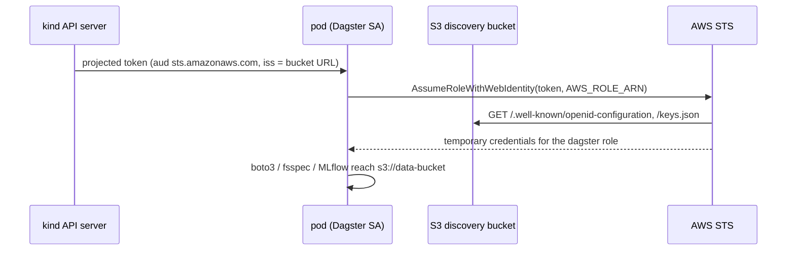

# kind + AWS data: local compute, cloud data

Data is harder to move than compute. This example runs the workloads layer on
a [kind](https://kind.sigs.k8s.io/) cluster -- a laptop, a CI runner, the same
recipe for an on-prem GPU box -- against **real AWS data**: an S3 bucket,
optionally an S3 Tables (Iceberg) namespace (Neon branches slot in the same way). The pods get
**per-service IAM roles, not keys**, through web-identity federation:



Three modules build the bridge, and `modules/workloads` is called exactly as
the EKS examples call it:

| Module | Role |
| --- | --- |
| [`aws/oidc-provider`](../../aws/oidc-provider) | publishes the kind cluster's OIDC discovery document + JWKS to a public-read S3 bucket and registers that URL with IAM (kind's API server is unreachable from AWS; this is what EKS does internally) |
| [`aws/data-adapter`](../../aws/data-adapter) | per-service roles trusting that issuer, emitted with `binding = "projected"`: pods mount a token, the SDK reads `AWS_ROLE_ARN` + `AWS_WEB_IDENTITY_TOKEN_FILE` |
| [`modules/workloads`](../../modules/workloads) | mounts the projected token; otherwise unchanged |

## Run it

Needs `kind`, `kubectl`, `helm`, `tofu`, the AWS CLI with credentials that can
create a bucket, IAM roles and an OIDC provider, and a container runtime.

```bash
cd examples/kind-aws-data
export OIDC_BUCKET=lab-kind-oidc-$(aws sts get-caller-identity --query Account --output text)
scripts/up.sh          # ~10 min: kind (with issuer flags) -> prereqs -> tofu apply -> verify
scripts/down.sh
```

The ordering matters and `scripts/up.sh` encodes it:

1. [`scripts/kind-up.sh`](scripts/kind-up.sh) creates the cluster with
   `--service-account-issuer=https://$OIDC_BUCKET.s3.<region>.amazonaws.com/<cluster>`
   (the URL must be baked in before the first token is minted) and exports
   the JWKS to `jwks.json`.
2. `prereqs.sh` from [`examples/kind`](../kind) installs KubeRay,
   metrics-server and Postgres (`WITH_S3=0`: the object store is S3).
3. `tofu apply` creates the data bucket, publishes the discovery documents,
   registers the provider, creates the roles, and deploys the workloads.
4. [`scripts/verify.sh`](scripts/verify.sh) runs the health checks, then
   starts a pod as the Dagster ServiceAccount with only the contract's env and
   projected token and has it run `aws sts get-caller-identity` and list the
   bucket.

Rotating keys (a new kind cluster) is a re-apply with the new `jwks.json`.

## Options

- **Iceberg**: `-var iceberg_table_bucket_arn=<S3 Tables bucket ARN>` carves an
  ephemeral namespace (`aws/iceberg-branches`) and grants the pipeline roles
  read/write on it; `ICEBERG_NAMESPACE` reaches Dagster user code.
- **Neon**: swap the in-cluster Postgres for copy-on-write branches of prod
  by adding the `module "neon"` block from [`examples/preview`](../preview)
  (`modules/neon-branches`) and feeding its connections to the `*_db_*`
  inputs. It is not wired here because the Neon provider requires an API key
  at plan time even with no branches, which would make the example
  non-runnable without a Neon account.
- **Static keys instead of federation**: leave `oidc_bucket_name` empty and
  pass `static_aws_access_key_id` / `static_aws_secret_access_key` of an IAM
  user that has the bucket's `putget` policy. Same contract, third mechanism;
  rotation becomes yours. Useful when hosting an issuer is not worth it.
- **A preview-shaped stamp**: `-var name_prefix=pr7-` prefixes namespaces,
  roles and hostnames exactly as a preview does.

## Costs and caveats

One S3 bucket (KMS-encrypted; a few cents), two tiny public objects, IAM roles
(free), and S3 egress for what the laptop reads (~$0.09/GB). Heavy jobs still
belong next to the data; this cell is for development, cheap GPU bursts on
subsets, and hardware AWS does not have.

The gated CI leg in [`kind-smoke.yml`](../../.github/workflows/kind-smoke.yml)
runs this end to end when `ENABLE_KIND_AWS_DATA` is set (see the workflow
header for the repo variables it needs).
